# EasyEPLANner Updater - Open Source

EasyEPLANner Updater - Средство управления обновлениями для проекта [EasyEPLANner](https://github.com/savushkin-r-d/EasyEPLANner).
Запуск данного приложения из надстройки и при запуске EPLAN работает начиная с версии **EasyEPLANner** [2023.12.28](https://github.com/savushkin-r-d/EasyEPLANner/releases/tag/2023.12.28).

## EasyEPLANner Updater - документация по использованию

 + [Установка](#установка)
 + [Настройки приложения](#настройки-приложения)
 + [Использование приложения](#использование-приложения)
 + [Как создать PAT](#как-создать-pat)

### Установка

Последнюю версию приложения можно скачать [здесь](https://github.com/savushkin-r-d/EasyEPLANnerUpdater/releases/latest). Установленный архив необходимо распаковать в папку надстройки **EasyEPLANner** (обычно это **EasyEPlanner 2.9**). Конечный путь установленного приложения должен выглядеть следующим образом: **EasyEPlanner 2.9\Updater\EasyEPLANnerUpdater.exe**.

При запуске приложения может возникнуть следующая ошибка, указывающая что необходимо установить _dotnet-8_:

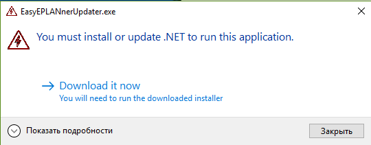

Для установки нажмите [**Download it now**](https://dotnet.microsoft.com/en-us/download/dotnet/thank-you/runtime-desktop-8.0.0-windows-x64-installer?cid=getdotnetcore). Если установка сразу не началась и вы перешли на страницу, которая показана на картинке ниже, то нажмите на одну из указанных на картинке ссылок:

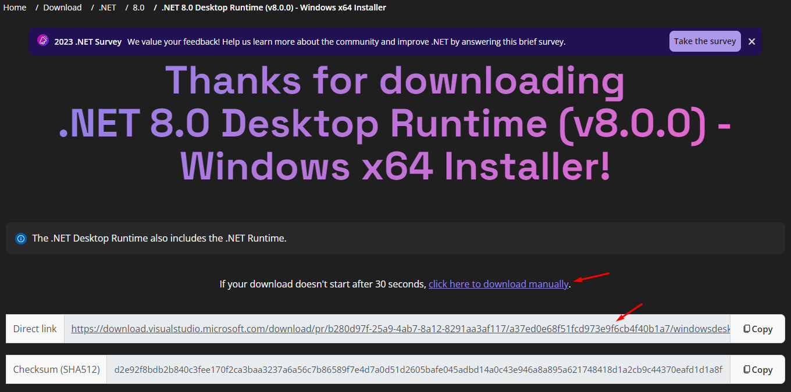

После скачивания файла, запустите установку, не забыв предварительно разблокировать его в свойствах:

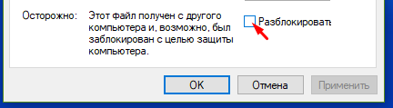

После установки можно запускать приложение.

### Настройки приложения

Чтобы открыть настройки приложения, нажмите на . После чего откроется окно настроек приложения:

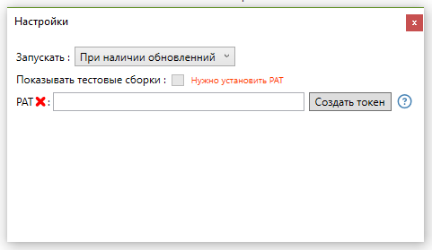

 - **Запускать**:
    
   Данный пункт отвечает за запуск приложения при открытии **EPLAN** и имеет 3 настройки:
    - **Всегда** - приложение будет всегда запускаться при запуске EPLAN
    - **При наличии обновлений** (Значение по-умолчанию)
    - **Никогда**

 - **Показывать тестовы сборки**: 
 
   Показывает тестовые сборки (сборки из пулл реквестов), которые так-же можно установить. Для использования данной настройки необходимо [создать и установить PAT](#как-создать-pat).

 - **PAT** - personal access token:
    
   Персональный токен доступа - заменяет аутентификацию GitHub. Нужен для снятия ограничения по на проверку обновлений, а так же для установки тестовых сборок. [Как создать PAT](#как-создать-pat).

### Использование приложения

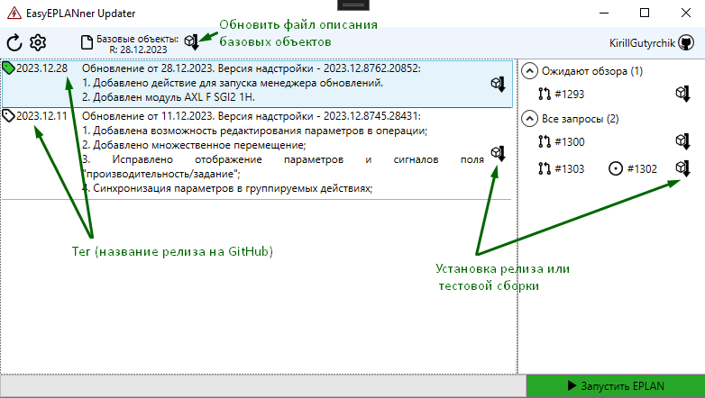

При запуске приложения с самого начала отображаются новые релизы доступные для скачивания, при желании можно отобразить все релизы.
Текущий релиз отмечен тегом зелегоно цвета как показано на рисунке выше.

Для установки релиза конкретной версии необходимо просто нажать на кнопку установки.

На панели инструментов находится кнопка обновления описания базовых объектов, где указана используемая версия файла. Eсли установлен пулл-реквест, то указывается его номер, в случае с релизами указывается дата релиза. При необходимости, можно обновить файл описания базовых объектов нажав на эту кнопку, в этом случае будет указана дата последнего обновления этого файла. Для использования данной функции также необходимо создать и правильно настроить [PAT](#как-создать-pat).   

В правой части приложения на рисунке выше находятся тестовые сборки пулл-реквестов, их также можно установить. Наведя на значек пулл-реквеста можно увидеть его краткое описание, а так же, если пулл-реквест привязан к конкретной проблеме, то и ее описание тоже. А при их нажатии можно перейти на страницу этого пулл-реквеста/проблемы. 

Пулл-ревесты, к которым запрошен обзор пользователя выделены в отдельную группу "**Ожидают обзора**". Это значит, что вы можете загрузить эту сборку и проверить изменения, после чего перейти к пулл-реквесту и оставить свой отзыв.

Кнопка запуска выключает данное приложение и запускает EPLAN (если до этого приложение уже было открыто через EPLAN).

### Как создать PAT

Что дает установка **PAT**? - Установка **PAT** снимает ограничение на 60 запросов в час с одного **IP** а так же позволяет скачивать тестовые сборки пулл реквестов.

Создать PAT можно [здесь](https://github.com/settings/tokens/new) (перейти в [настройки профиля](https://github.com/settings/) на GitHub, после на пункт **<>Developer settings** -> **Personal access tokens** -> **Tokens (classic)** после чего нажать _Generate new token (classic)_).

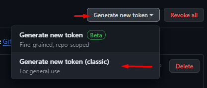

Далее нужно настроить токен. Введите произвольное имя токена, выберите срок действия токена и настройте области действия, установите галоучку на **repo** (как показано на рисунке ниже):

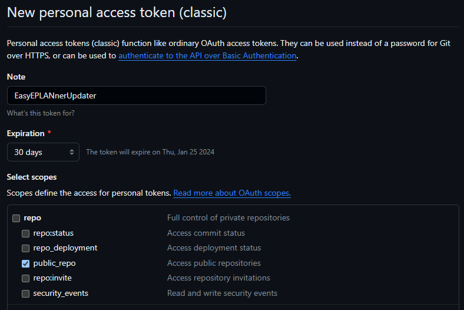

После создания токена, на некоторое время отобразится его значение, которое необходимо скопировать:

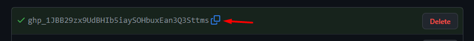

После чего перейти в настройки приложения и в поле **PAT** вставить скопированный токен:

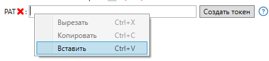

В результате **PAT** отобразит галочку, если все хорошо, а в правом верхнем углу приложения отобразится под каким пользователем был выполнен вход:

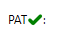

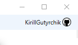

## License
The project is licensed under [MIT](LICENSE) license.
