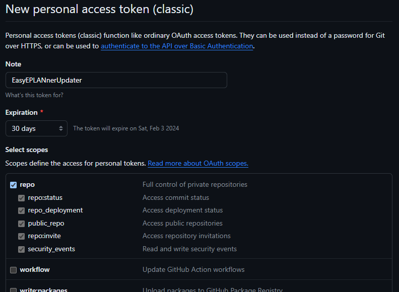

# EasyEPLANner Updater - Open Source

EasyEPLANner Updater - Средство управления обновлениями для проекта [EasyEPLANner](https://github.com/savushkin-r-d/EasyEPLANner).

## EasyEPLANner Updater - документация по использованию

 + [Установка](#установка)
 + [Настройки приложения](#настройки-приложения)
 + [Использование приложения](#использование-приложения)
 + [Как создать PAT](#как-создать-pat)

### Установка

Папка с приложением должна находится в папке надстройки **EasyEPLANner** (обычно это **EasyEPlanner 2.9**).\
Конечный путь установленного приложения должен выглядеть следующим образом: **EasyEPlanner 2.9\Updater\EasyEPLANnerUpdater.exe**

### Настройки приложения

Чтобы открыть настройки приложения, нажмите на <svg fill=Black width=21 height=21 style="background-color:white">
    <path d="M 10 0.5 a 9.84 9.84 90 0 1 0.8412 0.0372 C 11.7328 0.614 12.388 1.274 12.592 2.048 l 0.3456 1.3284 c 0.0216 0.0792 0.0948 0.1896 0.2544 0.2688 c 0.2772 0.1368 0.5448 0.2916 0.8016 0.4632 c 0.1476 0.0984 0.2796 0.108 0.3588 0.0852 l 1.3236 -0.3636 c 0.7728 -0.2112 1.6704 0.0252 2.184 0.756 c 0.324 0.462 0.6072 0.9504 0.8448 1.4616 c 0.378 0.81 0.1332 1.7064 -0.4368 2.2692 l -0.9768 0.9672 c -0.0588 0.0576 -0.1176 0.1764 -0.1056 0.3528 c 0.0192 0.3084 0.0192 0.618 0 0.9264 c -0.012 0.1764 0.0456 0.2952 0.1056 0.3528 l 0.9768 0.9672 c 0.57 0.5628 0.8148 1.4592 0.4368 2.2692 a 9.5724 9.5724 90 0 1 -0.8448 1.4604 c -0.5136 0.732 -1.4112 0.9684 -2.184 0.756 l -1.3224 -0.3624 c -0.0804 -0.0228 -0.2124 -0.0132 -0.36 0.0852 a 7.0908 7.0908 90 0 1 -0.8016 0.4632 c -0.1596 0.0792 -0.2328 0.1896 -0.2532 0.2688 l -0.348 1.3272 c -0.2016 0.7752 -0.858 1.4352 -1.7496 1.512 a 9.6072 9.6072 90 0 1 -1.6824 0 c -0.8916 -0.0768 -1.5468 -0.7368 -1.7496 -1.512 l -0.3468 -1.3272 c -0.0216 -0.0792 -0.0948 -0.1896 -0.2544 -0.2688 a 6.8856 6.8856 90 0 1 -0.8016 -0.4632 c -0.1476 -0.0984 -0.2796 -0.108 -0.3588 -0.0852 l -1.3236 0.3636 c -0.7728 0.2112 -1.6704 -0.0252 -2.184 -0.756 a 9.744 9.744 90 0 1 -0.8448 -1.4616 c -0.378 -0.81 -0.1332 -1.7064 0.4356 -2.2692 l 0.978 -0.9672 c 0.06 -0.0576 0.1176 -0.1764 0.1056 -0.3528 a 7.4568 7.4568 90 0 1 0 -0.9264 c 0.012 -0.1764 -0.0456 -0.2952 -0.1056 -0.3528 l -0.978 -0.9672 C 1.162 7.754 0.9172 6.8576 1.2952 6.0476 a 9.504 9.504 90 0 1 0.8448 -1.4604 c 0.5136 -0.732 1.4112 -0.9684 2.184 -0.756 l 1.3224 0.3624 c 0.0804 0.0228 0.2124 0.0132 0.36 -0.0852 c 0.2568 -0.1716 0.5244 -0.3264 0.8016 -0.4632 c 0.1596 -0.0792 0.2328 -0.1896 0.2532 -0.2688 l 0.348 -1.3272 C 7.6108 1.274 8.2672 0.614 9.1588 0.536 C 9.436 0.512 9.7168 0.5 10 0.5 Z m -0.6852 1.83 c -0.0432 0.0036 -0.1296 0.0432 -0.1644 0.1752 l -0.3468 1.326 c -0.1764 0.6732 -0.6588 1.1604 -1.1976 1.4268 c -0.2076 0.1032 -0.408 0.2196 -0.6 0.348 c -0.5004 0.3336 -1.164 0.5076 -1.8348 0.324 l -1.3236 -0.3636 c -0.1308 -0.036 -0.21 0.0192 -0.234 0.054 c -0.264 0.3744 -0.4944 0.7728 -0.6876 1.188 c -0.0168 0.0372 -0.0252 0.132 0.0708 0.228 l 0.978 0.9672 c 0.4932 0.4872 0.6744 1.1484 0.636 1.7472 a 5.6508 5.6508 90 0 0 0 0.6984 c 0.0384 0.5988 -0.1428 1.26 -0.636 1.7472 l -0.978 0.9672 c -0.0972 0.096 -0.0876 0.1908 -0.0708 0.228 c 0.1944 0.4152 0.4236 0.8124 0.6876 1.1868 c 0.024 0.036 0.102 0.0912 0.234 0.0552 l 1.3224 -0.3636 c 0.672 -0.1836 1.3356 -0.0096 1.836 0.324 c 0.1932 0.1284 0.3936 0.2448 0.6012 0.348 c 0.5364 0.2664 1.02 0.7548 1.1964 1.4268 l 0.3468 1.326 c 0.0348 0.1308 0.1212 0.1716 0.1644 0.1752 a 7.92 7.92 90 0 0 1.3704 0 c 0.0432 -0.0036 0.1296 -0.0432 0.1644 -0.1752 l 0.3468 -1.326 c 0.1764 -0.6732 0.6588 -1.1604 1.1976 -1.4268 c 0.2076 -0.1032 0.408 -0.2196 0.6 -0.348 c 0.5004 -0.3336 1.164 -0.5076 1.8348 -0.324 l 1.3236 0.3636 c 0.1308 0.0348 0.21 -0.0192 0.234 -0.054 c 0.264 -0.3756 0.4932 -0.7728 0.6876 -1.188 c 0.0168 -0.0372 0.0252 -0.132 -0.0708 -0.228 l -0.978 -0.9672 c -0.4932 -0.4872 -0.6744 -1.1484 -0.636 -1.7472 a 5.6508 5.6508 90 0 0 0 -0.6984 c -0.0384 -0.5988 0.1428 -1.26 0.636 -1.7472 l 0.978 -0.9672 c 0.0972 -0.096 0.0876 -0.1908 0.0708 -0.228 a 7.7568 7.7568 90 0 0 -0.6876 -1.1868 c -0.024 -0.036 -0.102 -0.0912 -0.234 -0.0552 l -1.3224 0.3636 c -0.672 0.1836 -1.3356 0.0096 -1.836 -0.324 a 5.328 5.328 90 0 0 -0.6012 -0.348 c -0.5364 -0.2664 -1.02 -0.7548 -1.1964 -1.4268 l -0.3468 -1.326 c -0.0348 -0.132 -0.1212 -0.1716 -0.1644 -0.1752 a 7.92 7.92 90 0 0 -1.3704 0 Z M 13.6 10.1 a 3.6 3.6 90 1 1 -7.2 0 a 3.6 3.6 90 0 1 7.2 0 Z M 11.8 10.1 a 1.8 1.8 90 1 0 -3.6012 0.0012 A 1.8 1.8 90 0 0 11.8 10.1 Z"/>
</svg>.\
После чего откроется окно настроек приложения:

 - **Запускать**:\
    Данный пункт отвечает за запуск приложения при открытии **EPLAN** и имеет 3 настройки:
    - **Всегда** - приложение будет всегда запускаться при запуске EPLAN
    - **При наличии обновлений** (Значение по-умолчанию)
    - **Никогда**

 - **Показывать тестовы сборки**:\
    Показывает тестовые сборки (сборки из пулл реквестов), которые так-же можно установить. Для использования данной настройки необходимо [создать и установить PAT](#как-создать-pat).

 - **PAT** - personal access token:\
    Персональный токен доступа - заменяет аутентификацию GitHub. Нужен для снятия ограничения по на проверку обновлений, а так же для установки тестовых сборок.\
    [Как создать PAT](#как-создать-pat)

### Использование приложения

При запуске приложения с самого начала отображаются новые релизы доступные для скачивания, при желании можно отобразить все релизы.
Текущий релиз отмечен тегом зелегоно цвета как показано на рисунке выше.

Для установки релиза конкретной версии необходимо просто нажать на кнопку установки.

В правой части приложения на рисунке выше находятся тестовые сборки пулл-реквестов, их также можно установить. Наведя на значек пулл-реквеста можно увидеть его краткое описание, а так же, если пулл-реквест привязан к конкретной проблеме, то и ее описание тоже. А при их нажатии можно перейти на страницу этого пулл-реквеста/проблемы.

Кнопка запуска выключает данное приложение и запускает EPLAN (если до этого приложение уже было открыто через EPLAN).

### Как создать PAT

Что дает установка **PAT**? - Установка **PAT** снимает ограничение на 60 запросов в час с одного **IP** а так же позволяет скачивать тестовые сборки пулл реквестов.

Чтобы создать PAT, в приложении можно нажать на кнопку <kbd>[Создать токен](https://github.com/settings/tokens/new)</kbd>
или перейти в [настройки профиля](https://github.com/settings/) на GitHub,
после на пункт **<>Developer settings** ->
<svg width=16 height=16 fill=white style="background-color:Black">
    <path d="M10.5 0a5.499 5.499 0 1 1-1.288 10.848l-.932.932a.749.749 0 0 1-.53.22H7v.75a.749.749 0 0 1-.22.53l-.5.5a.749.749 0 0 1-.53.22H5v.75a.749.749 0 0 1-.22.53l-.5.5a.749.749 0 0 1-.53.22h-2A1.75 1.75 0 0 1 0 14.25v-2c0-.199.079-.389.22-.53l4.932-4.932A5.5 5.5 0 0 1 10.5 0Zm-4 5.5c-.001.431.069.86.205 1.269a.75.75 0 0 1-.181.768L1.5 12.56v1.69c0 .138.112.25.25.25h1.69l.06-.06v-1.19a.75.75 0 0 1 .75-.75h1.19l.06-.06v-1.19a.75.75 0 0 1 .75-.75h1.19l1.023-1.025a.75.75 0 0 1 .768-.18A4 4 0 1 0 6.5 5.5ZM11 6a1 1 0 1 1 0-2 1 1 0 0 1 0 2Z"/>
</svg> 
**Personal access tokens** 
-> **Tokens (classic)** после чего нажать _Generate new token (classic)_\

Далее нужно настроить токен. Введите произвольное имя токена, выберите срок действия токена и настройте области действия, достаточно будет пункта **public_repo** (как показано на рисунке ниже):\

После создания токена, на некоторое время отобразится его значение, которое необходимо скопировать:\

После чего перейти в настройки приложения и в поле **PAT** вставить скопированный токен:\

В результате **PAT** отобразит галочку, если все хорошо, а в правом верхнем углу приложения отобразится под каким пользователем был выполнен вход:\
\

## License
The project is licensed under [MIT](LICENSE) license.
